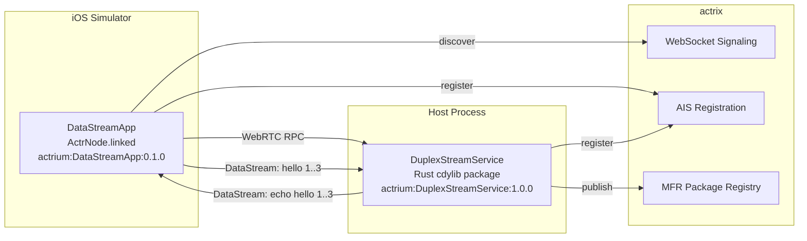

# Swift DataStreamApp E2E

End-to-end test that verifies an iOS linked-runtime app can send three WebRTC datastream messages to a package-backed Rust `DuplexStreamService` and receive the matching echo stream replies through local actrix signaling.

## Architecture



## Flow

`run.sh` dynamically builds both sides from the empty template:

1. Start local actrix, create a realm, and provision an E2E manufacturer keychain.
2. Initialize a temporary Rust service with `actr init --template empty`, then write the E2E `duplex_stream.proto`, manifest exports, Cargo files, and Rust handler.
3. Run `actr deps install`, `actr gen -l rust`, `actr build`, and publish `actrium:DuplexStreamService:1.0.0`.
4. Publish a linked-runtime identity marker for `actrium:DataStreamApp:0.1.0`.
5. Initialize a temporary Swift app with `actr init --template empty`, then write local `probe.proto`, DataStreamApp sources, `manifest.toml`, `actr.toml`, and `project.yml`.
6. Start the package-backed Rust service and wait until `DuplexStreamService` is registered with signaling.
7. Run `actr deps install` so the app fetches the remote `duplex_stream.proto` from the published service, run `actr gen -l swift`, then build it with XcodeGen/Xcode.
8. Install the app into the iOS Simulator and launch it with `ACTR_DATASTREAMAPP_AUTO_STREAM_COUNT=3`.
9. DataStreamApp sends `hello 1`, `hello 2`, and `hello 3`; the service replies with `echo: hello 1`, `echo: hello 2`, and `echo: hello 3`.
10. `run.sh` waits for `ACTR_E2E_RESULT:3/3` in the app logs.

## File Structure

```
e2e/swift-datastream-app/
├── run.sh                 # CI orchestration and dynamic empty-template scaffolding
├── actr.toml.tpl          # Runtime config template rendered into the temporary app
├── manifest.toml          # Source template for DataStreamApp package identity/dependency
├── project.yml            # Source template for the XcodeGen override
├── lib/
│   └── readiness.sh       # wait_for_service_registration helper
├── protos/
│   ├── local/
│   │   ├── probe.proto
│   │   └── duplex_stream.proto
│   └── remote/
│       └── duplex-stream-service/
│           └── duplex_stream.proto
└── DataStreamApp/
    ├── App/
    ├── Probes/
    ├── Services/
    ├── Views/
    └── Info.plist
```

`DataStreamApp/Generated` is intentionally not checked in. `run.sh` creates it in the temporary Swift app with `actr gen -l swift`.

## Verification Mechanism

The main acceptance path is the 3-message stream echo check:

1. `ACTR_DATASTREAMAPP_AUTO_STREAM_COUNT=3` triggers `sendHelloStreamChunks(count: 3)`.
2. The app discovers `${MANUFACTURER}:DuplexStreamService:1.0.0`.
3. It opens a duplex stream and sends `hello 1`, `hello 2`, `hello 3`.
4. The service echoes each payload as `echo: hello N`.
5. The app verifies the ordered received lines and prints `ACTR_E2E_RESULT:3/3`.

The older 8-probe runner remains in source for manual/debug use, but it is not the CI acceptance marker.

## Run

```bash
# Local (macOS only)
bash e2e/swift-datastream-app/run.sh

# Keep artifacts on failure
KEEP_TMP=1 bash e2e/swift-datastream-app/run.sh

# Capture diagnostics even on success
CAPTURE_DIAGNOSTICS_ON_SUCCESS=1 bash e2e/swift-datastream-app/run.sh
```

## Diagnostics

On failure, `run.sh` captures process status, signaling health, service registration rows from `signaling_cache.db`, filtered actrix/server logs, and app stdout/stderr. Sensitive values are redacted before sanitized logs are moved to `.tmp/sanitized-logs`.

## CI

Defined in `.github/workflows/ci-e2e.yml` as the `swift-datastream-app-e2e` job. It is a heavy macOS Simulator E2E and is intended for scheduled/manual execution rather than a fast PR gate.
